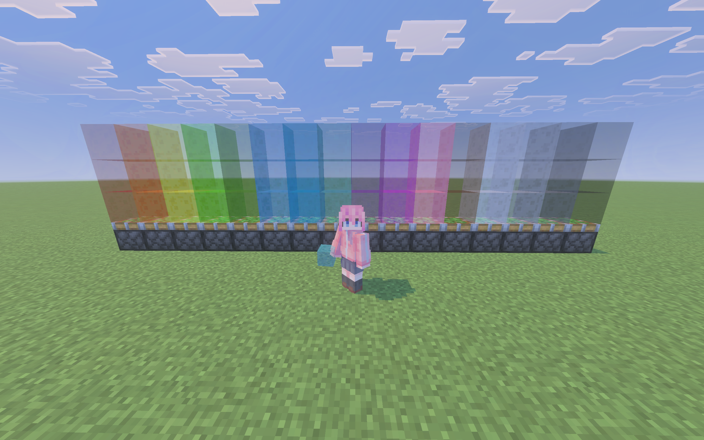

# ColoredSlimeBlock

A plugin for [AllayMC](https://github.com/AllayMC/Allay) that adds 16 colored slime blocks to the game.



## Features

- **16 Colors**: Red, Orange, Yellow, Lime, Green, Light Blue, Blue, Cyan, Purple, Magenta, Pink, Brown, White, Light Gray, Gray, Black
- **Bounce Effect**: Entities bounce when landing on colored slime blocks (same as vanilla slime)
- **No Fall Damage**: 100% fall damage reduction when landing on colored slime blocks
- **Piston Mechanics**: Same-colored blocks stick together, different colors do NOT stick to each other
- **Crafting Recipes**: Slime Block + Dye = Colored Slime Block
- **Creative Inventory**: All blocks available in the Nature category

## Requirements

- AllayMC 0.23.0-SNAPSHOT or later

## Installation

1. Download the latest release from [Releases](https://github.com/AllayMC/ColoredSlimeBlock/releases)
2. Place the `.jar` file in your server's `plugins` folder
3. Restart the server

## Building

```bash
./gradlew build
```

The built plugin will be located at `build/libs/`.

## Crafting

Each colored slime block can be crafted using:
- 1x Slime Block
- 1x Dye (corresponding color)

| Color      | Dye            |
|------------|----------------|
| Red        | Red Dye        |
| Orange     | Orange Dye     |
| Yellow     | Yellow Dye     |
| Lime       | Lime Dye       |
| Green      | Green Dye      |
| Light Blue | Light Blue Dye |
| Blue       | Blue Dye       |
| Cyan       | Cyan Dye       |
| Purple     | Purple Dye     |
| Magenta    | Magenta Dye    |
| Pink       | Pink Dye       |
| Brown      | Brown Dye      |
| White      | White Dye      |
| Light Gray | Light Gray Dye |
| Gray       | Gray Dye       |
| Black      | Black Dye      |

## License

This project is open source.
